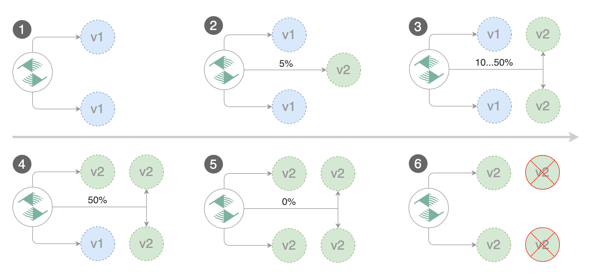
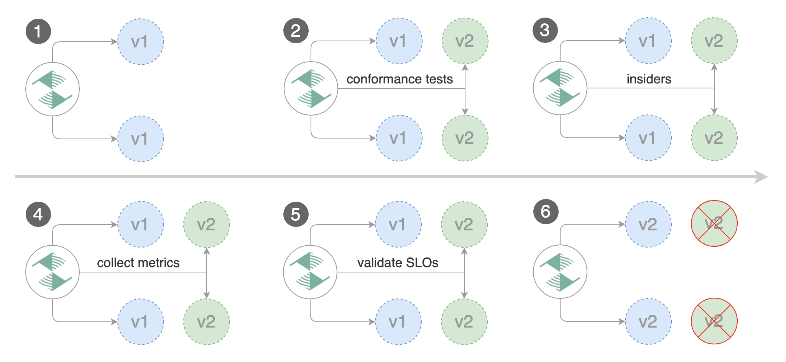

# Flagger Deployment Strategies

## Deployment Strategies

### Canary Release (progressive traffic shifting)



**sifts traffic** to the canary while measuring key performance indicators like **HTTP requests success rate**,
**requests average duration** and **pod health**.
The canary analysis runs periodically until it **reaches the maximum traffic weight** or **the failed checks threshold**.

```yaml
  analysis:
    # schedule interval (default 60s)
    interval: 1m
    # max number of failed metric checks before rollback
    threshold: 10
    # max traffic percentage routed to canary
    # percentage (0-100)
    maxWeight: 50
    # canary increment step
    # percentage (0-100)
    stepWeight: 2
    # promotion increment step (default 100)
    # percentage (0-100)
    stepWeightPromotion: 100
  # deploy straight to production without the metrics and webhook checks
  skipAnalysis: false
```

**The above analysis, if it succeeds, will run for 25 minutes while validating the HTTP metrics and webhooks every minute**

You can determine the **minimum time it takes to validate and promote a canary deployment** using **this formula**:

```
interval * (maxWeight / stepWeight)
```

And the **time** it takes for a **canary to be rollback** when the metrics or webhook checks are failing:

```
interval * threshold
```

### A/B Testing (HTTP headers and cookies traffic routing)

For frontend applications that **require session affinity** you should use **HTTP headers or cookies match conditions** to ensure a set of users will **stay on the same version for the whole duration of the canary analysis**.

You can enable A/B testing by specifying the **HTTP match conditions** and the number of iterations. If Flagger finds a HTTP match condition, it will ignore the **maxWeight** and **stepWeight** settings.



```yaml
  analysis:
    # schedule interval (default 60s)
    interval: 1m
    # total number of iterations
    iterations: 10
    # max number of failed iterations before rollback
    threshold: 2
    # canary match condition
    match:
      - headers:
          x-canary:
            regex: ".*insider.*"
      - headers:
          cookie:
            regex: "^(.*?;)?(canary=always)(;.*)?$"
```

### Blue/Green (traffic switching)


### Blue/Green Mirroring (traffic shadowing) (not supported)

### Canary Release with Session Affinity (progressive traffic shifting combined with cookie based routing) (not supported)
