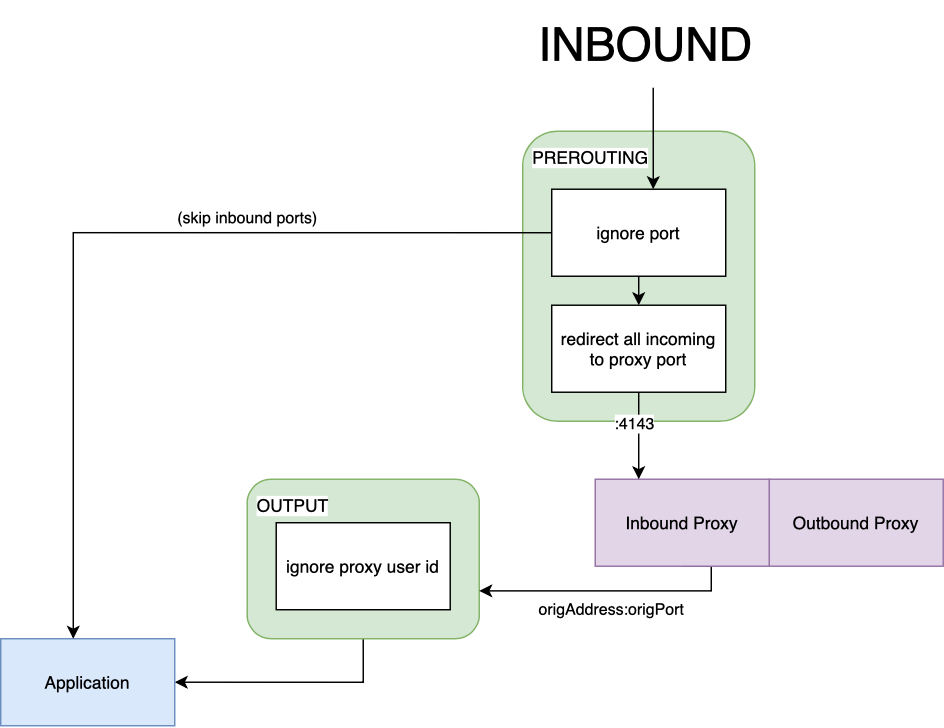
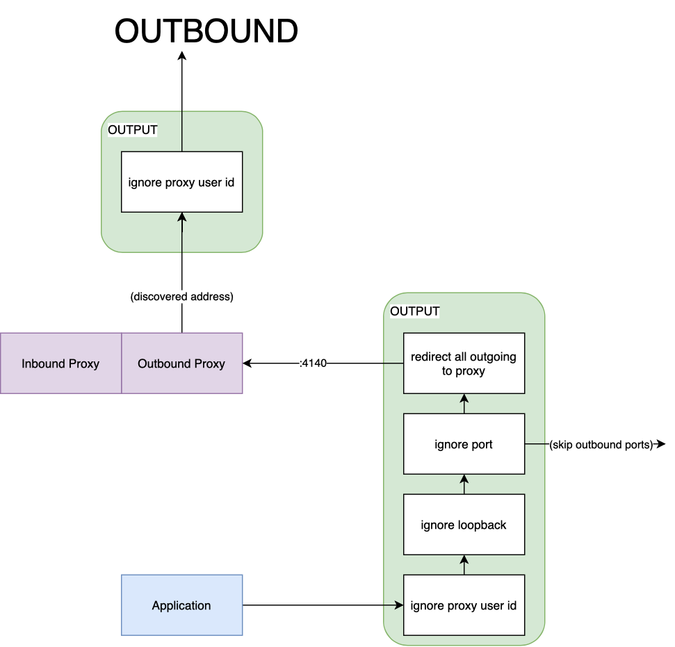
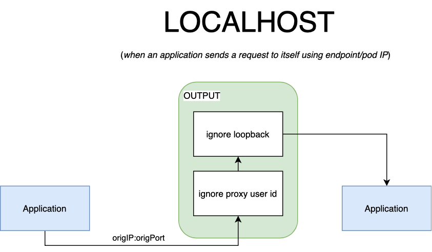
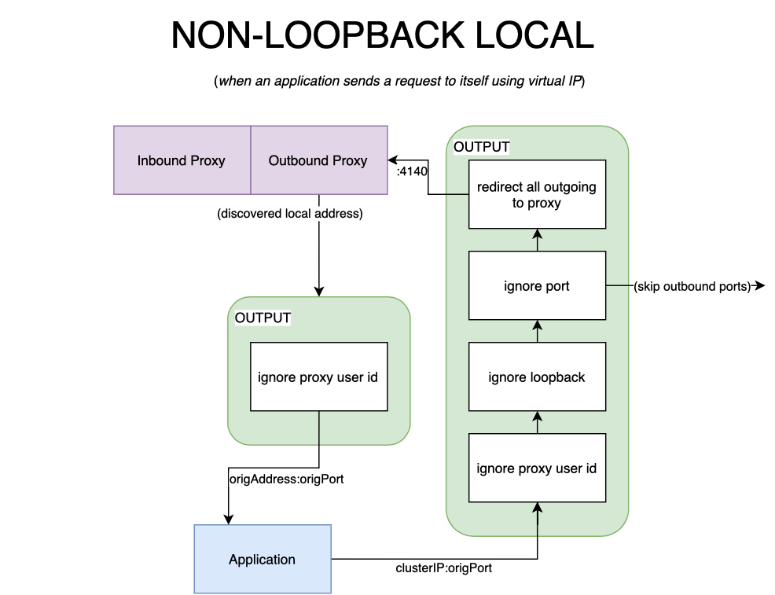

# Linkerd Iptables

**init container** is used to set up **iptables rules** at the **start of an injected pod’s lifecycle**.
**linkerd-init** will create two chains in the **nat table**: **PROXY_INIT_REDIRECT**, and **PROXY_INIT_OUTPUT**

---------------------------------------------------------------------------------------------------

## Inbound connections

When a **packet arrives in a pod**, it will typically be processed by the **PREROUTING chain**, a **default chain attached to the nat table**.
The **sidecar container** will create a new chain to process **inbound packets**, called **PROXY_INIT_REDIRECT**.
The **sidecar container** creates **a rule (install-proxy-init-prerouting)** to send packets from the **PREROUTING chain to our redirect chain**

The **redirect chain** will be configured with two more rules:

* **ignore-port:** will ignore processing packets whose destination ports are included in the **skip-inbound-ports** install option.
* **proxy-init-redirect-all:** will redirect all incoming TCP packets through the proxy, on port **4143**.

> The packet will arrive on the **PREROUTING chain** and will be immediately routed to the **redirect chain**. If its destination port matches any of the **inbound ports to skip**, then it will be **forwarded directly to the application process**, bypassing the proxy., Redirection is done by changing the incoming packet’s **destination header**, the target port will be **replaced with 4143, which is the proxy’s inbound port**. ,The proxy will process the packet and **produce a new one** that will be **forwarded to the service**; it will be able to get **the original target (IP:PORT) of the inbound packet** by using a **special socket option SO_ORIGINAL_DST** ,The new packet will be routed through the **OUTPUT chain**, from there it will be **sent to the application**.



---------------------------------------------------------------------------------------------------

## Outbound connections

When a **packet leaves a pod**, it will first traverse the **OUTPUT chain**, the first **default chain an outgoing packet traverses in the nat table**.

**To redirect outgoing packets** through the outbound side of the proxy, the sidecar container will again **create a new chain**

any packet that traverses the **OUTPUT chain** should be **forwarded to** our **PROXY_INIT_OUTPUT chain** to be processed.

* **ignore-proxy-uid:** any packets **owned by the proxy** (whose user id is 2102), will **skip processing and return to** the previous **(OUTPUT) chain**.
* **ignore-loopback:** if the packet is sent over the **loopback interface (lo)**, it will **skip processing and return to the previous chain**.
* **ignore-port:** will ignore processing packets whose **destination ports** are included in the **skip-outbound-ports** install option.
* **redirect-all-outgoing:** the last rule in the chain, it will **redirect all outgoing TCP packets to port 4140**, the **proxy’s outbound port**

> the **packet’s header** (**SO_ORIGINAL_DST**) will be **re-written** to target the **outbound port**. The proxy will process the packet and then forward it to its destination



---------------------------------------------------------------------------------------------------

## A service send requests to itself

This scenario would typically apply when:

* **The destination** is **the pod (or endpoint) IP address**. (target another container in the pod)
* **The destination** is **a port bound on localhost** (regardless of which container it belongs to).

> The **first rule will be skipped**, since the **owner is the application, and not the proxy**. Once **the second rule is matched**, the packets will return to the first output chain, from here, they’ll be **sent directly to the service**.



---------------------------------------------------------------------------------------------------

## A service send requests to itself using its clusterIP

in such cases, it is not guaranteed that the destination will be local. The packet follows an unusual path, as depicted in the diagram below.

> the packet’s destination will be an address that **is not considered to be local by the kernel**, it is, after all, a **virtual IP**. The proxy will process the packet, at a connection level, connections to **a clusterIP will be load balanced between endpoints**.,Chances are that the endpoint selected will be the pod itself, **packets will therefore never leave the pod**; the destination will be resolved to the podIP. In practice, this is treated as if the destination was loopback, with the exception that the packet is forwarded through the proxy, instead of being forwarded from the service directly to itself.



---------------------------------------------------------------------------------------------------

## Rules table

if you want to inspect the iptables rules created for a pod, you can retrieve them through the following command:

```bash
kubectl -n <namesppace> logs <pod-name> linkerd-init
```
[iptables rules table in outbound and inbound](https://linkerd.io/2.12/reference/iptables/#rules-table)

---------------------------------------------------------------------------------------------------

## Proxy Init Iptables Modes

Linkerd will configure a set of firewall rules in each injected pod. 
Configuration can be done either through an **init container** or through a **CNI plugin**

Linkerd’s init container can be run in two separate modes: **legacy** or **nft**. 
The difference between the two modes is what variant of **iptables** they will use to configure firewall rules.
Once configured, all injected workloads (including the control plane) will use the **same mode** in the **init container**.


* **legacy mode** will call into **iptables-legacy** for firewall configuration. 
    This is the **default mode that linkerd-init runs in**, and is supported by most operating systems and distributions.

* **nft mode** will call into **iptables-nft**, which uses the **newer nf_tables kernel API**.
    The [nftables] utilities are used by **newer operating systems** to configure firewalls by default.

```bash
linkerd install --set "proxyInit.mode=nft" | kubectl apply -f -
```

[legacy vs nft mode](https://developers.redhat.com/blog/2020/08/18/iptables-the-two-variants-and-their-relationship-with-nftables#)