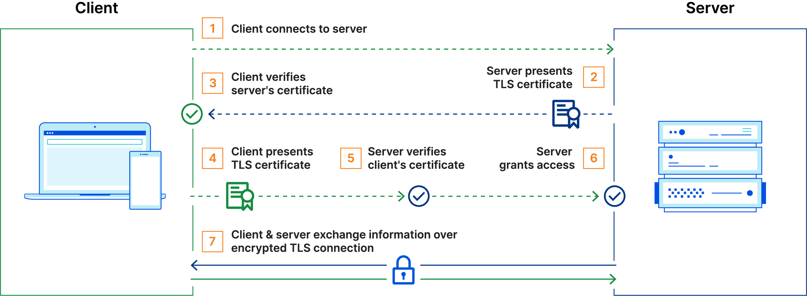

# Linkerd MTLS

### Mutual Authentication

The root certificate is self-signed, meaning that the organization creates it themselves. 
(This approach does not work for one-way TLS on the public Internet because an external certificate authority has to issue those certificates.)

mTLS prevents various kinds of attacks, including:
* On-path attacks
* Spoofing attacks
* Credential stuffing
* Brute force attacks
* Phishing attacks
* Malicious API requests



---------------------------------------------------------------------------------------------------

## Generating your own mTLS root certificates

Linkerd needs a **trust anchor certificate** and an **issuer certificate** with its corresponding key.
When installing with **linkerd install**, these certificates are **automatically generated**.
Alternatively, you can specify your own with the **--identity-** flags.


**ECDSA P-256 algorithm** which is the default for **step** == **openssl ecparam -name prime256v1**

### Trust anchor certificate

**The trust anchor has a limited period of validity: 365 days if generated by linkerd install**

generate the root certificate with its private key:

```bash
step certificate create root.linkerd.cluster.local ca.crt ca.key \
--profile root-ca --no-password --insecure
```
this generates the **ca.crt** and **ca.key** files.


use **--no-password --insecure** to avoid encrypting those files with a passphrase.

**longer-lived** trust anchor certificate, pass the **--not-after** argument **(--not-after=87600h)**.

### Issuer certificate and key

Then generate the intermediate certificate and key pair:

```bash
step certificate create identity.linkerd.cluster.local issuer.crt issuer.key \
--profile intermediate-ca --not-after 8760h --no-password --insecure \
--ca ca.crt --ca-key ca.key
```
This will generate the **issuer.crt** and **issuer.key** files.


### Passing the certificates to Linkerd

```bash
# first, install the Linkerd CRDs
linkerd install --crds | kubectl apply -f -

# install the Linkerd control plane, with the certificates we just generated.
linkerd install \
  --identity-trust-anchors-file ca.crt \
  --identity-issuer-certificate-file issuer.crt \
  --identity-issuer-key-file issuer.key \
  | kubectl apply -f -
```

---------------------------------------------------------------------------------------------------

## Manually Rotating Control Plane TLS Credentials

**this part only applies if the trust anchor is currently valid**

Understanding the current state of your system:

```
linkerd check --proxy
```

### Read the current trust anchor certificate from the cluster

```bash
kubectl -n linkerd get cm linkerd-identity-trust-roots -o=jsonpath='{.data.ca-bundle\.crt}' > original-trust.crt
```
This will generate the **original-trust.crt** file.


### Generate a new trust anchor:

```bash
step certificate create root.linkerd.cluster.local ca-new.crt ca-new.key --profile root-ca --no-password --insecure
```
This will generate the **ca-new.crt** , **ca-new.key** file.


### Bundle your original trust anchor with the new one

```bash
step certificate bundle ca-new.crt original-trust.crt bundle.crt
```
This will generate the **bundle.crt** file.

### Deploying the new bundle to Linkerd

use the **linkerd upgrade** command to instruct Linkerd to work with the **new trust bundle**

```bash
linkerd upgrade --identity-trust-anchors-file=./bundle.crt | kubectl apply -f -
```

we need to **restart your meshed workloads** so that they use the new trust anchor

```
kubectl -n emojivoto rollout restart deploy
```

check command to ensure that everything is ok :
```
linkerd check --proxy
```

### Rotating the identity issuer certificate

generating the new identity issuer certificate and key:

```bash
step certificate create identity.linkerd.cluster.local issuer-new.crt issuer-new.key \
--profile intermediate-ca --not-after 8760h --no-password --insecure \
--ca ca-new.crt --ca-key ca-new.key
```

This new **issuer certificate** is signed by our **new trust anchor**,
which is why it was critical to install the new trust anchor bundle

rotate the identity issuer certificate and key by using the upgrade command again:
```bash
linkerd upgrade \
    --identity-issuer-certificate-file=./issuer-new.crt \
    --identity-issuer-key-file=./issuer-new.key \
    | kubectl apply -f -
```

check for the **IssuerUpdated Kubernetes event** to be certain that Linkerd saw the new issuer certificate:
```bash
kubectl get events --field-selector reason=IssuerUpdated -n linkerd
```

**Restart the proxy for all injected workloads** in your cluster to ensure that their proxies pick up certificates
issued by the new issuer:

```bash
kubectl -n emojivoto rollout restart deploy
linkerd check --proxy
```

### Removing the old trust anchor

Since the old trust anchor is now completely unused, we can now switch Linkerd from the **bundle**
we created for the trust anchor **to** using **only the new trust anchor certificate**

```bash
linkerd upgrade  --identity-trust-anchors-file=./ca-new.crt  | kubectl apply -f -
```

```bash
kubectl -n emojivoto rollout restart deploy
linkerd check --proxy
```
---------------------------------------------------------------------------------------------------

## Replacing expired certificates

### Replacing the root and issuer certificates

If your root certificate is expired or you do not have its key, you need to
replace both your root and issuer certificates at the same time

same as before like **Generating your own mTLS root certificates**

generate the root certificate with its private key:
```bash
step certificate create root.linkerd.cluster.local ca.crt ca.key \
--profile root-ca --no-password --insecure
```
this generates the **ca.crt** and **ca.key** files.


Then generate the intermediate certificate and key pair:
```bash
step certificate create identity.linkerd.cluster.local issuer.crt issuer.key \
--profile intermediate-ca --not-after 8760h --no-password --insecure \
--ca ca.crt --ca-key ca.key
```
This will generate the **issuer.crt** and **issuer.key** files.

```bash
linkerd upgrade \
    --identity-issuer-certificate-file=./issuer-new.crt \
    --identity-issuer-key-file=./issuer-new.key \
    --identity-trust-anchors-file=./ca-new.crt \
    --force \
    | kubectl apply -f -
```

```
linkerd check --proxy
kubectl rollout restart
```
---------------------------------------------------------------------------------------------------

## Rotating webhooks certificates

To secure the connections between the **Kubernetes API server and the webhooks**, all the webhooks are **TLS-enabled**.
The **x509 certificates** used by these webhooks are issued by the **self-signed CA certificates embedded in the webhooks configuration**.

By default, these certificates have a validity period of **365 days**. They are stored in the following **secrets**:

* In the **linkerd namespace:** **linkerd-policy-validator-k8s-tls, linkerd-proxy-injector-k8s-tls and linkerd-sp-validator-k8s-tls**
* In the **linkerd-viz namespace: tap-injector-k8s-tls**
* In the **linkerd-jaeger namespace: jaeger-injector-k8s-tls**

### Renewing the webhook certificates

To check the validity of all the TLS secrets:

```bash
SECRETS=("linkerd-policy-validator-k8s-tls" "linkerd-proxy-injector-k8s-tls" "linkerd-sp-validator-k8s-tls" "tap-injector-k8s-tls" "jaeger-injector-k8s-tls")
NS=("linkerd" "linkerd" "linkerd-viz" "linkerd-jaeger")
for idx in "${!SECRETS[@]}"; do \
  kubectl -n "${NS[$idx]}" get secret "${SECRETS[$idx]}" -ojsonpath='{.data.tls\.crt}' | \
    base64 --decode - | \
    step certificate inspect - | \
    grep -iA2 validity; \
done
```
Manually delete these secrets and use upgrade/install to recreate them,
The command will recreate the secrets without restarting Linkerd.

```bash
for idx in "${!SECRETS[@]}"; do \
  kubectl -n "${NS[$idx]}" delete secret "${SECRETS[$idx]}"; \
done

linkerd upgrade | kubectl apply -f -
linkerd viz install | kubectl apply -f -
linkerd jaeger install | kubectl apply -f -
```

Confirm that the secrets are recreated with new certificates:

```
for idx in "${!SECRETS[@]}"; do \
  kubectl -n "${NS[$idx]}" get secret "${SECRETS[$idx]}" -ojsonpath='{.data.crt\.pem}' | \
    base64 --decode - | \
    step certificate inspect - | \
    grep -iA2 validity; \
done

linkerd check
```

Restarting the pods that implement the webhooks and API services is usually not necessary,
If you **observe certificate expiry errors or mismatched CA certs, restart their pods** with:

```bash
kubectl -n linkerd rollout restart deploy \
  linkerd-proxy-injector \
  linkerd-sp-validator \

kubectl -n linkerd-viz rollout restart deploy tap tap-injector
kubectl -n linkerd-jaeger rollout restart deploy jaeger-injector
```

---------------------------------------------------------------------------------------------------

## Automatically Rotating Control Plane TLS Credentials


create the namespace that cert-manager will use to **store its Linkerd-related resources**.
```
kubectl create namespace linkerd
```

### Save the signing key pair as a Secret

using the step tool, create a signing key pair and store it in a Kubernetes Secret
for longer-lived trust anchor certificate, pass the **--not-after** (--not-after=87600h)
```
step certificate create root.linkerd.cluster.local ca.crt ca.key \
  --profile root-ca --no-password --insecure &&
  kubectl create secret tls \
    linkerd-trust-anchor \
    --cert=ca.crt \
    --key=ca.key \
    --namespace=linkerd
```

### Create an Issuer referencing the secret

**create root certificate (Trust anchor certificate)**

```
kubectl apply -f - <<EOF
apiVersion: cert-manager.io/v1
kind: Issuer
metadata:
  name: linkerd-trust-anchor
  namespace: linkerd
spec:
  ca:
    secretName: linkerd-trust-anchor
EOF
```

### Create a Certificate resource referencing the Issuer

**create Issuer certificate and key**

```
kubectl apply -f - <<EOF
apiVersion: cert-manager.io/v1
kind: Certificate
metadata:
  name: linkerd-identity-issuer
  namespace: linkerd
spec:
  secretName: linkerd-identity-issuer
  duration: 48h
  renewBefore: 25h
  issuerRef:
    name: linkerd-trust-anchor
    kind: Issuer
  commonName: identity.linkerd.cluster.local
  dnsNames:
  - identity.linkerd.cluster.local
  isCA: true
  privateKey:
    algorithm: ECDSA
  usages:
  - cert sign
  - crl sign
  - server auth
  - client auth
EOF
```
cert-manager can now use this Certificate resource to **obtain TLS credentials**,
which will be stored in a **secret named linkerd-identity-issuer**

```bash
kubectl get secret linkerd-identity-issuer -o yaml -n linkerd
```

### Using these credentials with CLI installation

For **CLI installation**, the **Linkerd control plane** should be installed with the **--identity-external-issuer flag**,
which instructs Linkerd to read certificates from the **linkerd-identity-issuer secret**. Whenever certificate and
key stored in the secret are updated,the identity service will automatically detect this change and reload the new credentials.


### Observing the update process

check for the **IssuerUpdated Kubernetes event** to be certain that Linkerd saw the new issuer certificate:
```bash
kubectl get events --field-selector reason=IssuerUpdated -n linkerd
```

## Automatically Rotating Webhook TLS Credentials


The **Linkerd control plane** contains several components, called **webhooks**, which are called **directly by Kubernetes** itself.

The **traffic from Kubernetes to the Linkerd webhooks** is secured with TLS and therefore each of the webhooks requires a secret containing TLS credentials.
These certificates are different from the ones that the Linkerd proxies use to secure pod-to-pod communication and use a completely separate trust chain.

when Linkerd is installed, TLS credentials are automatically generated for all of the webhooks, 
If these certificates expire or need to be regenerated for any reason, performing a Linkerd upgrade

### Install Cert manager and Linkerd

```
# control plane core
kubectl create namespace linkerd
kubectl label namespace linkerd \
  linkerd.io/is-control-plane=true \
  config.linkerd.io/admission-webhooks=disabled \
  linkerd.io/control-plane-ns=linkerd
kubectl annotate namespace linkerd linkerd.io/inject=disabled

# viz (ignore if not using the viz extension)
kubectl create namespace linkerd-viz
kubectl label namespace linkerd-viz linkerd.io/extension=viz

# jaeger (ignore if not using the jaeger extension)
kubectl create namespace linkerd-jaeger
kubectl label namespace linkerd-jaeger linkerd.io/extension=jaeger
```

### Save the signing key pair as a Secret

create a **signing key pair** which will be used to sign each of the **webhook certificates**:
```
step certificate create webhook.linkerd.cluster.local ca.crt ca.key \
  --profile root-ca --no-password --insecure --san webhook.linkerd.cluster.local

kubectl create secret tls webhook-issuer-tls --cert=ca.crt --key=ca.key --namespace=linkerd

# ignore if not using the viz extension
kubectl create secret tls webhook-issuer-tls --cert=ca.crt --key=ca.key --namespace=linkerd-viz

# ignore if not using the jaeger extension
kubectl create secret tls webhook-issuer-tls --cert=ca.crt --key=ca.key --namespace=linkerd-jaeger
```

### Create Issuers referencing the secrets

we can create **cert-manager “Issuer”** resources that reference them:

```
kubectl apply -f - <<EOF
apiVersion: cert-manager.io/v1
kind: Issuer
metadata:
  name: webhook-issuer
  namespace: linkerd
spec:
  ca:
    secretName: webhook-issuer-tls
---
# ignore if not using the viz extension
apiVersion: cert-manager.io/v1
kind: Issuer
metadata:
  name: webhook-issuer
  namespace: linkerd-viz
spec:
  ca:
    secretName: webhook-issuer-tls
---
# ignore if not using the jaeger extension
apiVersion: cert-manager.io/v1
kind: Issuer
metadata:
  name: webhook-issuer
  namespace: linkerd-jaeger
spec:
  ca:
    secretName: webhook-issuer-tls
EOF
```

### Issuing certificates and writing them to secrets

create **cert-manager "Certificate"** resources which **use the Issuers to generate the desired certificates**:

```
kubectl apply -f - <<EOF
apiVersion: cert-manager.io/v1
kind: Certificate
metadata:
  name: linkerd-policy-validator
  namespace: linkerd
spec:
  secretName: linkerd-policy-validator-k8s-tls
  duration: 24h
  renewBefore: 1h
  issuerRef:
    name: webhook-issuer
    kind: Issuer
  commonName: linkerd-policy-validator.linkerd.svc
  dnsNames:
  - linkerd-policy-validator.linkerd.svc
  isCA: false
  privateKey:
    algorithm: ECDSA
    encoding: PKCS8
  usages:
  - server auth
---
apiVersion: cert-manager.io/v1
kind: Certificate
metadata:
  name: linkerd-proxy-injector
  namespace: linkerd
spec:
  secretName: linkerd-proxy-injector-k8s-tls
  duration: 24h
  renewBefore: 1h
  issuerRef:
    name: webhook-issuer
    kind: Issuer
  commonName: linkerd-proxy-injector.linkerd.svc
  dnsNames:
  - linkerd-proxy-injector.linkerd.svc
  isCA: false
  privateKey:
    algorithm: ECDSA
  usages:
  - server auth
---
apiVersion: cert-manager.io/v1
kind: Certificate
metadata:
  name: linkerd-sp-validator
  namespace: linkerd
spec:
  secretName: linkerd-sp-validator-k8s-tls
  duration: 24h
  renewBefore: 1h
  issuerRef:
    name: webhook-issuer
    kind: Issuer
  commonName: linkerd-sp-validator.linkerd.svc
  dnsNames:
  - linkerd-sp-validator.linkerd.svc
  isCA: false
  privateKey:
    algorithm: ECDSA
  usages:
  - server auth
---
# ignore if not using the viz extension
apiVersion: cert-manager.io/v1
kind: Certificate
metadata:
  name: tap
  namespace: linkerd-viz
spec:
  secretName: tap-k8s-tls
  duration: 24h
  renewBefore: 1h
  issuerRef:
    name: webhook-issuer
    kind: Issuer
  commonName: tap.linkerd-viz.svc
  dnsNames:
  - tap.linkerd-viz.svc
  isCA: false
  privateKey:
    algorithm: ECDSA
  usages:
  - server auth
---
# ignore if not using the viz extension
apiVersion: cert-manager.io/v1
kind: Certificate
metadata:
  name: linkerd-tap-injector
  namespace: linkerd-viz
spec:
  secretName: tap-injector-k8s-tls
  duration: 24h
  renewBefore: 1h
  issuerRef:
    name: webhook-issuer
    kind: Issuer
  commonName: tap-injector.linkerd-viz.svc
  dnsNames:
  - tap-injector.linkerd-viz.svc
  isCA: false
  privateKey:
    algorithm: ECDSA
  usages:
  - server auth
---
# ignore if not using the jaeger extension
apiVersion: cert-manager.io/v1
kind: Certificate
metadata:
  name: jaeger-injector
  namespace: linkerd-jaeger
spec:
  secretName: jaeger-injector-k8s-tls
  duration: 24h
  renewBefore: 1h
  issuerRef:
    name: webhook-issuer
    kind: Issuer
  commonName: jaeger-injector.linkerd-jaeger.svc
  dnsNames:
  - jaeger-injector.linkerd-jaeger.svc
  isCA: false
  privateKey:
    algorithm: ECDSA
  usages:
  - server auth
EOF
```

### Using these credentials with CLI installation

To **configure Linkerd to use the credentials** from cert-manager rather than generating its own:

```
# first, install the Linkerd CRDs
linkerd install --crds | kubectl apply -f -

# install the Linkerd control plane, using the credentials
# from cert-manager
linkerd install \
  --set policyValidator.externalSecret=true \
  --set-file policyValidator.caBundle=ca.crt \
  --set proxyInjector.externalSecret=true \
  --set-file proxyInjector.caBundle=ca.crt \
  --set profileValidator.externalSecret=true \
  --set-file profileValidator.caBundle=ca.crt \
  | kubectl apply -f -

# ignore if not using the viz extension
linkerd viz install \
  --set tap.externalSecret=true \
  --set-file tap.caBundle=ca.crt \
  --set tapInjector.externalSecret=true \
  --set-file tapInjector.caBundle=ca.crt \
  | kubectl apply -f -

# ignore if not using the jaeger extension
linkerd jaeger install
  --set webhook.externalSecret=true \
  --set-file webhook.caBundle=ca.crt \
  | kubectl apply -f -
```

## Validating your mTLS traffic

* **Validating mTLS with linkerd viz edges**

we can view a summary of the TCP connections between services that are managed by Linkerd.

```bash
linkerd viz -n linkerd edges deployment
```

```
SRC          DST                      SRC_NS        DST_NS    SECURED
prometheus   linkerd-controller       linkerd-viz   linkerd   √
prometheus   linkerd-destination      linkerd-viz   linkerd   √
prometheus   linkerd-identity         linkerd-viz   linkerd   √
prometheus   linkerd-proxy-injector   linkerd-viz   linkerd   √
prometheus   linkerd-sp-validator     linkerd-viz   linkerd   √
```

* **Validating mTLS with linkerd viz tap**

watch the **requests and responses in real time** to understand what is getting mTLS’d.

**tls=no_tls_from_remote message** or **tls=true**

```
linkerd viz -n linkerd tap deploy
```

```
req id=0:0 proxy=in  src=10.42.0.1:60318 dst=10.42.0.23:9995 tls=no_tls_from_remote :method=GET :authority=10.42.0.23:9995 :path=/ready
...
```

* **Validating mTLS with tshark (tcpdump)**

The final way to validate mTLS is to look at raw network traffic within the cluster.

```
tshark -i any -d tcp.port==8080,ssl | grep -v 127.0.0.1
```

