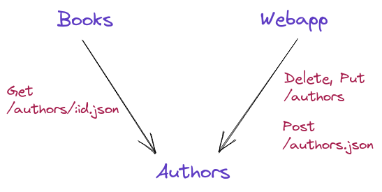

# Linkerd Policy

---------------------------------------------------------------------------------------------------

## Authorization Policy

Linkerd’s authorization policy allows you to control which types of traffic are allowed to meshed pods.

**example:**
you can restrict communication to a particular service (or HTTP route on a service) to only come from certain other services;
you can enforce that mTLS must be used on a certain port; and so on


### Default policies


The **config.linkerd.io/default-inbound-policy** annotation can be set at a namespace, workload, and pod level,
and will determine the default traffic policy at that point in the hierarchy


* **all-unauthenticated:** allow all requests. **This is the default**.
* **all-authenticated:** allow requests from meshed clients only.
* **cluster-authenticated:** allow requests form meshed clients in the same cluster. (multi cluster)
* **deny:** deny all requests.

Every cluster has a cluster-wide default policy (**by default, all-unauthenticated**), set at install time.
Annotations that are present at the workload or **namespace level** at pod creation time can override that value 
to determine the default policy for that pod.


### Fine-grained policies

For finer-grained policy that applies to specific **ports**, **routes**, or more, Linkerd uses a set of **CRDs**.

* **Server:** all traffic to a port, for a set of pods in a namespace
* **HTTPRoute:** a subset of HTTP requests for a Server
* **MeshTLSAuthentication:** authentication
* **NetworkAuthentication:** authentication based on IP address
* **AuthorizationPolicy:** a policy that restricts access to one or more targets unless an authentication rule is met
* **ServerAuthorization:** an earlier form of policy that restricts access to **Servers** only (not **HTTPRoutes**)

**AuthorizationPolicy** as a more flexible alternative to **ServerAuthorization** that can target **HTTPRoutes** as well as **Servers**.
**ServerAuthorization will be deprecated in future releases**.

---------------------------------------------------------------------------------------------------

## Authorization Policy ( Fine-grained )

### Server

A Server selects a **port** on a set of pods in the same namespace as the **server**.
While the Server resource is similar to a **Kubernetes Service**

When a Server selects a port, all traffic to that port is then **denied by default**, regardless of the default policy.
Thus, to authorize traffic to a port selected by a Server, you must create **AuthorizationPolicies**.


Server Spec:

* **podSelector:** 
A podSelector selects pods in the same namespace.
* **port**
A port name or number. Only ports in a pod spec’s ports are considered.
* **proxyProtocol:**
Configures protocol discovery for inbound connections. Supersedes the **config.linkerd.io/opaque-ports** annotation. 
Must be one of **unknown,HTTP/1,HTTP/2,gRPC,opaque,TLS**. **Defaults to unknown** if not set.


podSelector:

* **matchExpressions:**
matchExpressions is a list of label selector requirements. The requirements are ANDed.

* **matchLabels:**
A Server that selects over pods with a specific label, with gRPC as the proxyProtocol.

```yaml
apiVersion: policy.linkerd.io/v1beta1
kind: Server
metadata:
  namespace: emojivoto
  name: emoji-grpc
spec:
  podSelector:
    matchLabels:
      app: emoji-svc
  port: grpc
  proxyProtocol: gRPC
```

A Server that selects over pods with matchExpressions, with HTTP/2 as the proxyProtocol, on port 8080.

```yaml
apiVersion: policy.linkerd.io/v1beta1
kind: Server
metadata:
  namespace: emojivoto
  name: backend-services
spec:
  podSelector:
    matchExpressions:
    - {key: app, operator: In, values: [voting-svc, emoji-svc]}
    - {key: environment, operator: NotIn, values: [dev]}
  port: 8080
  proxyProtocol: "HTTP/2"
```

### HTTPRoute

* An HTTPRoute represents a **subset of** traffic handled by a **Server**.
* HTTPRoutes are **attached** to Servers and have match rules which determine which requests match.
  Matches can be based on **path, headers, query params**, and/or verb.
* **AuthorizationPolicies** may target HTTPRoute resources, thereby authorizing traffic to that HTTPRoute only rather than to the entire Server.


```yaml
apiVersion: policy.linkerd.io/v1beta1
kind: HTTPRoute
metadata:
  name: authors-get-route
  namespace: booksapp
spec:
  parentRefs:
    - name: authors-server
      kind: Server
      group: policy.linkerd.io
  rules:
    - matches:
      - path:
          value: "/authors.json"
        method: GET
      - path:
          value: "/authors/"
          type: "PathPrefix"
        method: GET
```


### AuthorizationPolicy

* An **AuthorizationPolicy** provides a way to authorize traffic to a **Server** or an **HTTPRoute**. 
* **AuthorizationPolicies** are a replacement for **ServerAuthorizations** which are more flexible because 
  they can target **HTTPRoutes** instead of only being able to target **Servers**.


An AuthorizationPolicy which authorizes clients that satisfy the authors-get-authn authentication to send to the authors-get-route **HTTPRoute**.

```yaml
apiVersion: policy.linkerd.io/v1alpha1
kind: AuthorizationPolicy
metadata:
  name: authors-get-policy
  namespace: booksapp
spec:
  targetRef:
    group: policy.linkerd.io
    kind: HTTPRoute
    name: authors-get-route
  requiredAuthenticationRefs:
    - name: authors-get-authn
      kind: MeshTLSAuthentication
      group: policy.linkerd.io
```

An AuthorizationPolicy which authorizes the webapp ServiceAccount to send to the authors **Server**.

```yaml
apiVersion: policy.linkerd.io/v1alpha1
kind: AuthorizationPolicy
metadata:
  name: authors-policy
  namespace: booksapp
spec:
  targetRef:
    group: policy.linkerd.io
    kind: Server
    name: authors
  requiredAuthenticationRefs:
    - name: webapp
      kind: ServiceAccount
```

An AuthorizationPolicy which authorizes the webapp ServiceAccount to send to all policy “targets” within the booksapp **namespace**.

```yaml
apiVersion: policy.linkerd.io/v1alpha1
kind: AuthorizationPolicy
metadata:
  name: authors-policy
  namespace: booksapp
spec:
  targetRef:
    kind: Namespace
    name: booksapp
  requiredAuthenticationRefs:
    - name: webapp
      kind: ServiceAccount
```

### MeshTLSAuthentication


* A MeshTLSAuthentication represents a **set of mesh identities**.
* When an **AuthorizationPolicy** has a MeshTLSAuthentication as one of its **requiredAuthenticationRefs**, this means that clients must be
  in the mesh and must have one of the specified identities in order to be authorized to send to the target.


A MeshTLSAuthentication which authenticates the books and webapp mesh identities.

```yaml
apiVersion: policy.linkerd.io/v1alpha1
kind: MeshTLSAuthentication
metadata:
  name: authors-get-authn
  namespace: booksapp
spec:
  identities:
    - "books.booksapp.serviceaccount.identity.linkerd.cluster.local"
    - "webapp.booksapp.serviceaccount.identity.linkerd.cluster.local"
```

A MeshTLSAuthentication which authenticate thes books and webapp mesh identities.
This is an alternative way to specify the same thing as the above example.

```yaml
apiVersion: policy.linkerd.io/v1alpha1
kind: MeshTLSAuthentication
metadata:
  name: authors-get-authn
  namespace: booksapp
spec:
  identityRefs:
    - kind: ServiceAccount
      name: books
    - kind: ServiceAccount
      name: webapp
```

### NetworkAuthentication

* A NetworkAuthentication represents a **set of IP subnets**.
* When an **AuthorizationPolicy** has a NetworkAuthentication as one of its **requiredAuthenticationRefs**,
  this means that clients must be in one of the specified networks in order to be authorized to send to the target.

```yaml
apiVersion: policy.linkerd.io/v1alpha1
kind: NetworkAuthentication
metadata:
  name: cluster-network
  namespace: booksapp
spec:
  networks:
  - cidr: 10.0.0.0/8
  - cidr: 100.64.0.0/10
  - cidr: 172.16.0.0/12
  - cidr: 192.168.0.0/16
```

### ServerAuthorization

* A ServerAuthorization provides a way to authorize traffic to **one or more Servers**.

*  AuthorizationPolicy is a more flexible alternative to ServerAuthorization that can target HTTPRoutes as well as Servers.
   Use of **AuthorizationPolicy is preferred**, and ServerAuthorization will be **deprecated** in future releases.


A ServerAuthorization that allows meshed clients with *.emojivoto.serviceaccount.identity.linkerd.cluster.local proxy identity i.e. 
all service accounts in the emojivoto namespace.

```yaml
apiVersion: policy.linkerd.io/v1beta1
kind: ServerAuthorization
metadata:
  namespace: emojivoto
  name: emoji-grpc
spec:
  # Allow all authenticated clients to access the (read-only) emoji service.
  server:
    selector:
      matchLabels:
        app: emoji-svc
  client:
    meshTLS:
      identities:
        - "*.emojivoto.serviceaccount.identity.linkerd.cluster.local"
```

A ServerAuthorization that allows any **unauthenticated** clients.

```yaml
apiVersion: policy.linkerd.io/v1beta1
kind: ServerAuthorization
metadata:
  namespace: emojivoto
  name: web-public
spec:
  server:
    name: web-http
  # Allow all clients to access the web HTTP port without regard for
  # authentication. If unauthenticated connections are permitted, there is no
  # need to describe authenticated clients.
  client:
    unauthenticated: true
    networks:
      - cidr: 0.0.0.0/0
      - cidr: ::/0
```
A ServerAuthorization that allows meshed clients with a specific service account.

```yaml
apiVersion: policy.linkerd.io/v1beta1
kind: ServerAuthorization
metadata:
  namespace: emojivoto
  name: prom-prometheus
spec:
  server:
    name: prom
  client:
    meshTLS:
      serviceAccounts:
        - namespace: linkerd-viz
          name: prometheus
```

---------------------------------------------------------------------------------------------------

## Restricting Access To Services

Linkerd policy resources can be used to restrict which clients may access a service. 


### Creating a Server resource

```yaml
---
apiVersion: policy.linkerd.io/v1beta1
kind: Server
metadata:
  namespace: emojivoto
  name: voting-grpc
  labels:
    app: voting-svc
spec:
  podSelector:
    matchLabels:
      app: voting-svc
  port: grpc
  proxyProtocol: gRPC
```

**linkerd viz authz** command to look at the **authorization status**

### Creating a ServerAuthorization resource

```yaml
---
apiVersion: policy.linkerd.io/v1beta1
kind: ServerAuthorization
metadata:
  namespace: emojivoto
  name: voting-grpc
  labels:
    app.kubernetes.io/part-of: emojivoto
    app.kubernetes.io/name: voting
    app.kubernetes.io/version: v11
spec:
  server:
    name: voting-grpc
  # The voting service only allows requests from the web service.
  client:
    meshTLS:
      serviceAccounts:
        - name: web
```

We can also test that request from other pods will be rejected by creating a grpcurl pod
and attempting to access the Voting service from it, Because this client has **not been authorized**,
this request gets rejected with a **PermissionDenied error**.

```bash
kubectl run grpcurl --rm -it --image=networld/grpcurl --restart=Never --command -- ./grpcurl -plaintext voting-svc.emojivoto:8080 emojivoto.v1.VotingService/VoteDog
```
```
Error invoking method "emojivoto.v1.VotingService/VoteDog": failed to query for service descriptor "emojivoto.v1.VotingService": rpc error: code = PermissionDenied desc =
```

### Setting a Default Policy

you can set a **default policy** which will apply to all ports which **do not have a Server resource defined**

* If the port has a Server resource and the client **matches a ServerAuthorization** resource for it: **ALLOW**
* If the port has a Server resource but the client **does not match any ServerAuthorizations** for it: **DENY**
* **if the port does not have a Server resource: use the default policy**


```bash
linkerd upgrade --default-inbound-policy deny | kubectl apply -f -
```

**or**

```
config.linkerd.io/default-inbound-policy annotation
```

### Notice

You may have noticed that there was a period of time after we created the **Server** resource but **before**
we created the **ServerAuthorization** where **all requests were being rejected**, To avoid this situation in live systems
==> **create the ServiceAuthorizations BEFORE creating the Server so that clients will be authorized immediately**

---------------------------------------------------------------------------------------------------

## Configuring Per-Route Policy

**authorization policies** can also be configured for **individual HTTP routes**.

we’ll use the Books demo app to demonstrate how to control which clients can access particular routes on a service.

 


### Creating a Server resource

command to list **the authorization resources** that currently exist for the **authors deployment**:


```bash
linkerd viz authz -n booksapp deploy/authors
```

> **In addition, a separate authorization is generated to allow liveness and readiness probes from the kubelet**.

```
ROUTE    SERVER                       AUTHORIZATION                UNAUTHORIZED  SUCCESS     RPS  LATENCY_P50  LATENCY_P95  LATENCY_P99
default  default:all-unauthenticated  default/all-unauthenticated        0.0rps   70.31%  8.1rps          1ms         43ms         49ms
probe    default:all-unauthenticated  default/probe                      0.0rps  100.00%  0.3rps          1ms          1ms          1ms
```

create a Server resource for the **authors deployment’s service port**:

```yaml
kubectl apply -f - <<EOF
---
apiVersion: policy.linkerd.io/v1beta1
kind: Server
metadata:
  name: authors-server
  namespace: booksapp
spec:
  podSelector:
    matchLabels:
      app: authors
      project: booksapp
  port: service
EOF
```

see that all traffic to **authors is currently unauthorized**:

```
linkerd viz authz -n booksapp deploy/authors
```

```
ROUTE    SERVER                       AUTHORIZATION                UNAUTHORIZED  SUCCESS     RPS  LATENCY_P50  LATENCY_P95  LATENCY_P99
default  authors-server                                                  9.5rps    0.00%  0.0rps          0ms          0ms          0ms
probe    authors-server               default/probe                      0.0rps  100.00%  0.1rps          1ms          1ms          1ms
default  default:all-unauthenticated  default/all-unauthenticated        0.0rps  100.00%  0.1rps          1ms          1ms          1ms
probe    default:all-unauthenticated  default/probe                      0.0rps  100.00%  0.2rps          1ms          1ms          1ms
```

### Creating per-route policy resources

create **HTTPRoute resources for the authors service**:

```yaml
kubectl apply -f - <<EOF

---
apiVersion: policy.linkerd.io/v1beta1
kind: HTTPRoute
metadata:
  name: authors-get-route
  namespace: booksapp
spec:
  parentRefs:
    - name: authors-server
      kind: Server
      group: policy.linkerd.io
  rules:
    - matches:
      - path:
          value: "/authors.json"
        method: GET
      - path:
          value: "/authors/"
          type: "PathPrefix"
        method: GET
EOF
```

create an **AuthorizationPolicy** resource that defines policy for our:

```yaml
kubectl apply -f - <<EOF

---
apiVersion: policy.linkerd.io/v1alpha1
kind: AuthorizationPolicy
metadata:
  name: authors-get-policy
  namespace: booksapp
spec:
  targetRef:
    group: policy.linkerd.io
    kind: HTTPRoute
    name: authors-get-route
  requiredAuthenticationRefs:
    - name: authors-get-authn
      kind: MeshTLSAuthentication
      group: policy.linkerd.io
---
apiVersion: policy.linkerd.io/v1alpha1
kind: MeshTLSAuthentication
metadata:
  name: authors-get-authn
  namespace: booksapp
spec:
  identities:
    - "books.booksapp.serviceaccount.identity.linkerd.cluster.local"
    - "webapp.booksapp.serviceaccount.identity.linkerd.cluster.local"
EOF
```

the default route for **liveness and readiness probes** will no longer be used, and the authors service will become **unready**.
Therefore , we must also create a HTTPRoute and AuthorizationPolicy so that **probes from the Kubelet are still authorized**:

```yaml
kubectl apply -f - <<EOF

---
apiVersion: policy.linkerd.io/v1beta1
kind: HTTPRoute
metadata:
  name: authors-probe-route
  namespace: booksapp
spec:
  parentRefs:
    - name: authors-server
      kind: Server
      group: policy.linkerd.io
  rules:
    - matches:
      - path:
          value: "/ping"
        method: GET
---
apiVersion: policy.linkerd.io/v1alpha1
kind: NetworkAuthentication
metadata:
  name: authors-probe-authn
  namespace: booksapp
spec:
  networks:
  - cidr: 0.0.0.0/0
  - cidr: ::/0
---
apiVersion: policy.linkerd.io/v1alpha1
kind: AuthorizationPolicy
metadata:
  name: authors-probe-policy
  namespace: booksapp
spec:
  targetRef:
    group: policy.linkerd.io
    kind: HTTPRoute
    name: authors-probe-route
  requiredAuthenticationRefs:
    - name: authors-probe-authn
      kind: NetworkAuthentication
      group: policy.linkerd.io
EOF
```

create an **additional HTTPRoute** resource that matches **PUT, POST, and DELETE** requests:

```yaml
kubectl apply -f - <<EOF

---
apiVersion: policy.linkerd.io/v1beta1
kind: HTTPRoute
metadata:
  name: authors-modify-route
  namespace: booksapp
spec:
  parentRefs:
    - name: authors-server
      kind: Server
      group: policy.linkerd.io
  rules:
    - matches:
      - path:
          value: "/authors/"
          type: "PathPrefix"
        method: DELETE
      - path:
          value: "/authors/"
          type: "PathPrefix"
        method: PUT
      - path:
          value: "/authors.json"
        method: POST
EOF
```

create authorization and authentication policy resources to authorize this route:

```yaml
kubectl apply -f - <<EOF

---
apiVersion: policy.linkerd.io/v1alpha1
kind: AuthorizationPolicy
metadata:
  name: authors-modify-policy
  namespace: booksapp
spec:
  targetRef:
    group: policy.linkerd.io
    kind: HTTPRoute
    name: authors-modify-route
  requiredAuthenticationRefs:
    - name: authors-modify-authn
      kind: MeshTLSAuthentication
      group: policy.linkerd.io
---
apiVersion: policy.linkerd.io/v1alpha1
kind: MeshTLSAuthentication
metadata:
  name: authors-modify-authn
  namespace: booksapp
spec:
  identities:
    - "webapp.booksapp.serviceaccount.identity.linkerd.cluster.local"
EOF
```

```bash
linkerd viz authz -n booksapp deploy/authors
```

see that all traffic is **authorized**:

```
ROUTE                 SERVER                       AUTHORIZATION                              UNAUTHORIZED  SUCCESS     RPS  LATENCY_P50  LATENCY_P95  LATENCY_P99
authors-get-route     authors-server               authorizationpolicy/authors-get-policy           0.0rps  100.00%  0.1rps          0ms          0ms          0ms
authors-modify-route  authors-server               authorizationpolicy/authors-modify-policy        0.0rps  100.00%  0.0rps          0ms          0ms          0ms
authors-probe-route   authors-server               authorizationpolicy/authors-probe-policy         0.0rps  100.00%  0.1rps          1ms          1ms          1ms
default               default:all-unauthenticated  default/all-unauthenticated                      0.0rps  100.00%  0.1rps          1ms          1ms          1ms
probe                 default:all-unauthenticated  default/probe                                    0.0rps  100.00%  0.2rps          1ms          1ms          1ms
```