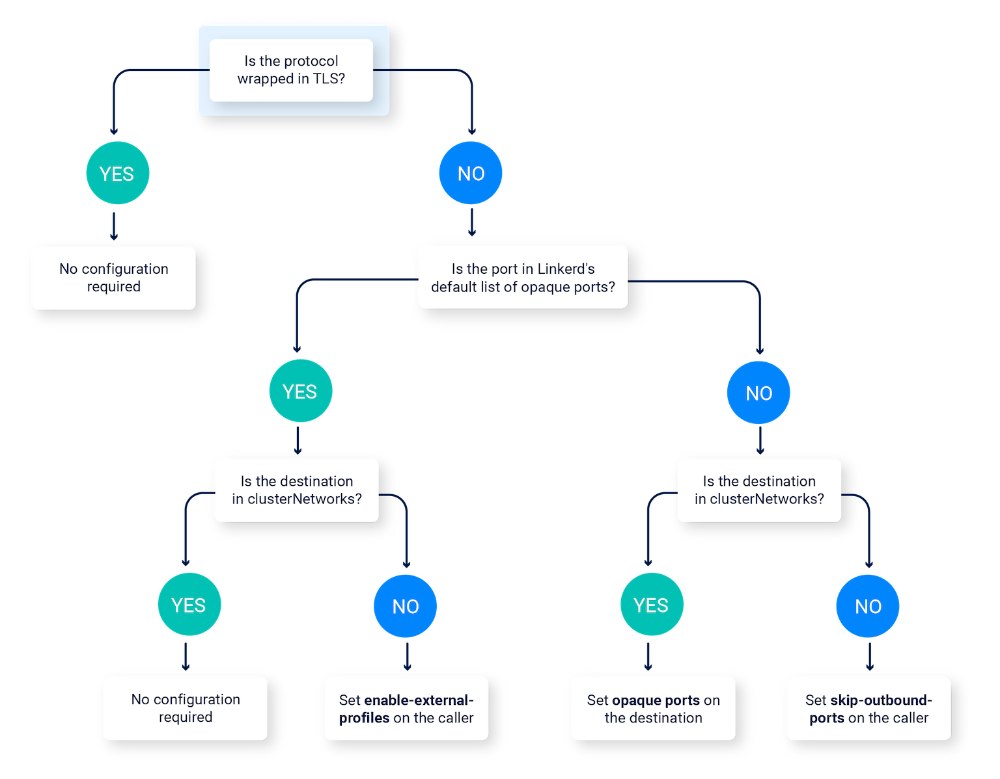

## linkerd

### Service Profiles

A service profile is a custom Kubernetes resource (CRD)

provide Linkerd additional information about a service and how to handle requests for a service

When an **HTTP** (not HTTPS) request is received by a **Linkerd proxy**, the destination service of that request is identified.
If a service profile for that destination service exists, then that service profile is used to to provide **per-route metrics**,
**retries** and **timeouts**.


### TCP Proxying and Protocol Detection

Linkerd is capable of proxying all TCP traffic, including TLS connections, WebSockets, and HTTP tunneling.

If Linkerd detects that a connection is HTTP or HTTP/2, Linkerd automatically provides **HTTP-level metrics and routing**.
If Linkerd cannot determine that a connection is using HTTP or HTTP/2, Linkerd will proxy the connection as a plain **TCP connection**

Linkerd’s protocol detection will time out because it doesn’t see any bytes from the client. This situation is commonly encountered when using
protocols where the server sends data before the client does (such as SMTP) or protocols that proactively establish connections without sending data 
(such as Memcache). In this case, the connection will proceed as a **TCP connection after a 10-second protocol detection delay**.

There are two basic mechanisms for configuring protocol detection:

* **Opaque ports** instruct Linkerd to skip protocol detection and proxy the connection as a **TCP stream**

(25 (SMTP), 587 (SMTP), 3306 (MySQL), 4444 (Galera), 5432 (Postgres), 6379 (Redis), 9300 (ElasticSearch), and 11211 (Memcache).)

You can use this annotation to mark a port as opaque.
```
config.linkerd.io/opaque-ports
```

* **Skip ports** bypass the proxy entirely
In this case, you can use this annotation to bypass the proxy entirely
```
config.linkerd.io/skip-outbound-ports
```

**Opaque ports** are generally preferred as they allow Linkerd to provide **mTLS, TCP-level metrics, policy**, etc. Skip ports circumvent Linkerd’s
ability to provide **security features**.

this annotation configures Linkerd to look for ServiceProfiles for off-cluster connections.
```
config.linkerd.io/enable-external-profiles
```



### Retries and Timeouts

* Per-Route Metrics

you must first create a service profile. Once a service profile has been created, Linkerd will add labels to the Prometheus 
metrics that associate a specific request to a specific route.

Routes configured in **service profiles** are different from **HTTPRoute resources**. Service profile routes allow you to collect 
per-route metrics and configure client-side behavior such as retries and timeouts. HTTPRoute resources, on the other hand,
can be the target of AuthorizationPolicies and allow you to specify per-route authorization.

view per-route metrics in the CLI by running 
```
linkerd viz routes svc/webapp
                   deploy/webapp
```

```
ROUTE                          SERVICE   SUCCESS      RPS   LATENCY_P50   LATENCY_P95   LATENCY_P99
[DEFAULT]                   kubernetes     0.00%   0.0rps           0ms           0ms           0ms
GET /                           webapp   100.00%   0.5rps          27ms          38ms          40ms
```

it is possible to filter all the way down to requests going from a specific resource to other services:

```
linkerd viz routes deploy/webapp --to svc/books
```

```
linkerd viz tap deploy/webapp -o wide
```

* Retries

**The reason why these pieces of configuration are required is because retries can potentially be dangerous.**

For routes that are idempotent and don’t have bodies, you can edit the service profile and add isRetryable to the retryable route:
```yaml
spec:
  routes:
  - name: GET /api/annotations
    condition:
      method: GET
      pathRegex: /api/annotations
    isRetryable: true ### ADD THIS LINE ###
```
A retry budget is a mechanism that **limits the number of retries** that can be performed against a service as a percentage of original requests.

```yaml
spec:
  retryBudget:
    retryRatio: 0.2
    minRetriesPerSecond: 10
    ttl: 10s


```
Retries can be monitored by using the **linkerd viz routes** command with the **--to** flag and the **-o wide** flag

Since an original request may fail the first time, but a retry of that request might succeed, the effective success rate is usually 
(but not always) higher than the actual success rate.

* Timeouts

To limit how long Linkerd will wait before failing an outgoing request to another service, you can configure timeouts.
**If this timeout is reached, Linkerd will cancel the request, and return a 504 response**

```yaml
spec:
  routes:
  - condition:
      method: HEAD
      pathRegex: /authors/[^/]*\.json
    name: HEAD /authors/{id}.json
    timeout: 300ms
```

### Telemetry and Monitoring

```
linkerd viz install | kubectl apply -f -
```

Golden metrics:

* Success Rate

This is the percentage of successful requests during a time window (1 minute by default).
In the output of the command **linkerd viz routes -o wide**, this metric is split into **EFFECTIVE_SUCCESS** and **ACTUAL_SUCCESS**

* Traffic (Requests Per Second)

This gives an overview of how much demand is placed on the service/route. As with success rates, **linkerd viz routes --o wide** 
splits this metric into **EFFECTIVE_RPS** and **ACTUAL_RPS**, corresponding to rates after and before retries respectively.

* Latencies

Times taken to service requests per service/route are split into **50th**, **95th** and **99th** **percentiles**. 
Lower percentiles give you an overview of the average performance of the system, while tail percentiles help catch outlier behavior.


### Authorization Policy

Linkerd’s authorization policy allows you to control which types of traffic are allowed to meshed pods.

**example:**
you can restrict communication to a particular service (or HTTP route on a service) to only come from certain other services;
you can enforce that mTLS must be used on a certain port; and so on


#### Default policies


The **config.linkerd.io/default-inbound-policy** annotation can be set at a namespace, workload, and pod level,
and will determine the default traffic policy at that point in the hierarchy


* **all-unauthenticated:** allow all requests. This is the default.
* **all-authenticated:** allow requests from meshed clients only.
* **cluster-authenticated:** allow requests form meshed clients in the same cluster.
* **deny:** deny all requests.

Every cluster has a cluster-wide default policy (**by default, all-unauthenticated**), set at install time.
Annotations that are present at the workload or **namespace level** at pod creation time can override that value 
to determine the default policy for that pod.


#### Fine-grained policies

For finer-grained policy that applies to specific ports, routes, or more, Linkerd uses a set of CRDs.

* **Server:** all traffic to a port, for a set of pods in a namespace
* **HTTPRoute:** a subset of HTTP requests for a Server
* **MeshTLSAuthentication:** authentication
* **NetworkAuthentication:** authentication based on IP address
* **AuthorizationPolicy:** a policy that restricts access to one or more targets unless an authentication rule is met
* **ServerAuthorization:** an earlier form of policy that restricts access to **Servers** only (not **HTTPRoutes**)

**AuthorizationPolicy** as a more flexible alternative to **ServerAuthorization** that can target **HTTPRoutes** as well as **Servers**.
**ServerAuthorization will be deprecated in future releases**.


### Debugging 502s

When the Linkerd proxy encounters connection errors while processing a request, it will typically return an **HTTP 502 (Bad Gateway)** response.

Common Causes of Connection Errors:

* **Connection Idle Timeouts**

This means that the server will close any connections which do not receive any traffic in the specified time period.

* **Half-closed Connection Timeouts**

During the shutdown of a TCP connection, each side of the connection must be closed independently.
When one side is closed but the other is not, the connection is said to be **“half-closed”**.

This can lead to responses not being delivered and to **port conflicts when establishing new connections** which manifest as **502 responses**.

Detect half-open connections in Kubernetes 
```bash
#!/bin/bash

pods=$(kubectl get po -A -l linkerd.io/control-plane-ns -ojsonpath="{range .items[*]}{.metadata.name} {.metadata.namespace}{'\n'}{end}")

IFS=" "

while read name namespace; do
  tcp=$(kubectl debug -n $namespace $name --image=cr.l5d.io/linkerd/debug:stable-2.12.0 -it -- cat /proc/net/tcp)
  close_wait=$(echo $tcp | awk 'BEGIN {cnt=0} $4==08 {cnt++} END {print cnt}')
  fin_wait_2=$(echo $tcp | awk 'BEGIN {cnt=0} $4==05 {cnt++} END {print cnt}')
  if [ "$close_wait" -gt "0" -o "$fin_wait_2" -gt "0" ]; then
        echo "$name.$namespace has $close_wait sockets in CLOSE_WAIT and $fin_wait_2 sockets in FIN_WAIT_2"
  else
        echo "$name.$namespace is okay"
  fi
done <<< "$pods"
```

One solution would be to update your application to not leave connections half-closed for long periods of time or to stop using software that does this.

Another option is to **increase the connection tracker’s timeout** for half-closed connections,
default value of this timeout is platform dependent but is typically **1 minute or 1 hour**.

the current value by looking at the file: any injected container
```
/proc/sys/net/netfilter/nf_conntrack_tcp_timeout_close_wait
```

To increase this: 
```
linkerd inject --close-wait-timeout
```

and this command set the **privileged field** of the **proxy init** container to **true**.

### Automatic mTLS
### Ingress
### Load Balancing
### Automatic Proxy Injection
### Dashboard and on-cluster metrics stack
### Distributed Tracing
### Fault Injection
### High Availability
### HTTP Access Logging
### Multi-cluster communication
### Traffic Split (canaries, blue/green deploys)


